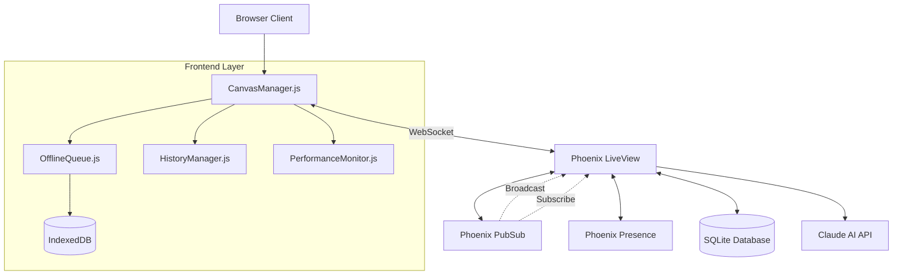
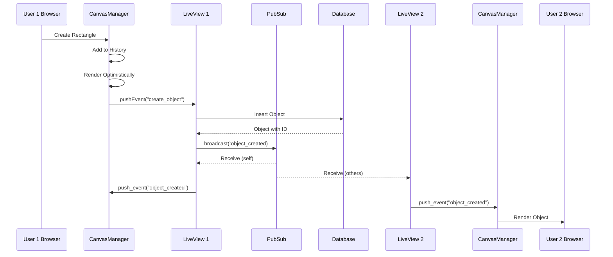
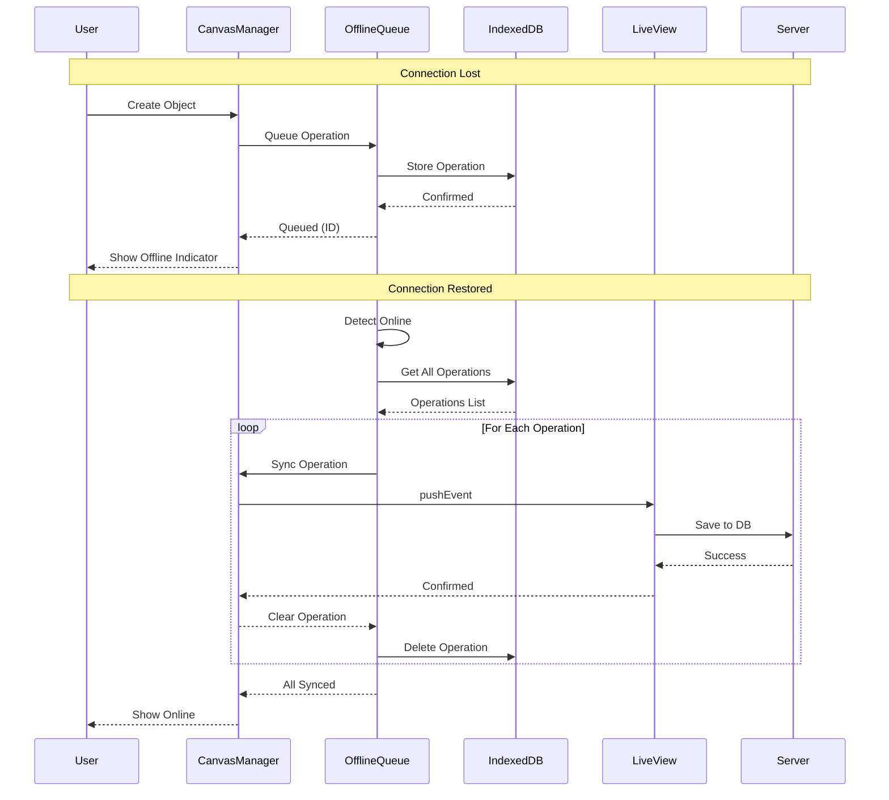
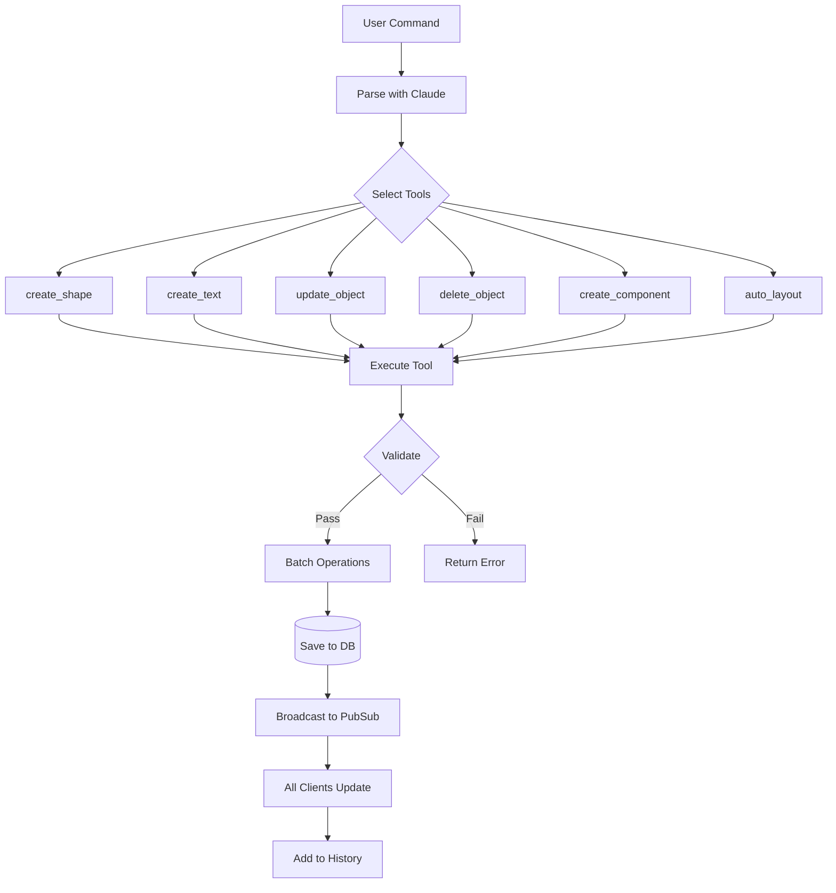
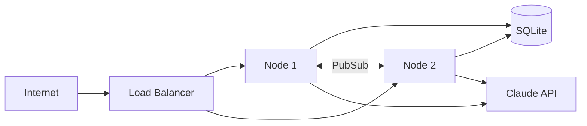

# CollabCanvas Core Architecture Documentation

## System Overview

CollabCanvas is a real-time collaborative canvas application built with Phoenix LiveView, PixiJS, and IndexedDB. It provides a robust foundation for multi-user design collaboration with offline support, presence tracking, and AI assistance.

## Architecture Diagram



## Real-Time Sync Flow

### Object Creation Flow



### Offline Operation Queue Flow



## Component Architecture

### Frontend Components

#### CanvasManager.js
- **Responsibilities**: 
  - PixiJS application lifecycle management
  - Object rendering and interactions
  - Event emission to LiveView
  - Tool state management
  - Pan, zoom, and viewport management
  
- **Key Features**:
  - Multi-object selection
  - Drag and drop
  - Rotation and resize handles
  - Performance monitoring
  - Lock indicators
  - Offline queue integration

#### OfflineQueue.js
- **Responsibilities**:
  - Detect online/offline state
  - Queue operations in IndexedDB
  - Sync operations on reconnection
  - Show connection status
  
- **Storage Format**:
```javascript
{
  id: 123,
  type: "create" | "update" | "delete",
  data: { /* operation payload */ },
  timestamp: 1634567890123,
  retries: 0
}
```

#### HistoryManager.js
- **Responsibilities**:
  - Maintain undo/redo stacks
  - Batch multi-object operations
  - Support Cmd/Ctrl+Z and Cmd/Ctrl+Shift+Z
  
- **Operation Types**:
  - Single operations (create, update, delete)
  - Batch operations (AI-generated, multi-select)
  - Maximum 50 operations in history

### Backend Components

#### CanvasLive (LiveView)
- **Responsibilities**:
  - WebSocket connection management
  - Database persistence
  - PubSub broadcasting
  - Presence tracking
  - AI command processing

- **State Management**:
```elixir
%{
  canvas: %Canvas{},
  objects: [%Object{}],
  presences: %{user_id => metadata},
  user_id: "user_123",
  topic: "canvas:456",
  selected_tool: "select",
  ai_loading: false
}
```

#### Phoenix PubSub
- **Topic Format**: `"canvas:#{canvas_id}"`
- **Event Types**:
  - `:object_created`
  - `:object_updated`
  - `:object_deleted`
  - `:object_locked`
  - `:object_unlocked`
  - `:presence_diff`

#### Phoenix Presence
- **Metadata Structure**:
```elixir
%{
  online_at: unix_timestamp,
  cursor: %{x: 100, y: 200},
  color: "#3b82f6",
  name: "John Doe",
  email: "john@example.com",
  avatar: "https://..."
}
```

## AI Agent Decision Flow



## Key Design Decisions

### 1. Optimistic UI Updates
**Decision**: Render objects immediately on the client before server confirmation.

**Rationale**: 
- Provides instant feedback
- Reduces perceived latency
- Works well with offline queue

**Trade-offs**:
- Must handle conflicts
- Need unique temp IDs
- Requires cleanup on failure

### 2. CRDT-based Presence
**Decision**: Use Phoenix Presence for user tracking.

**Rationale**:
- Built-in CRDT guarantees eventual consistency
- Automatic cleanup on disconnect
- Handles network partitions

**Benefits**:
- No manual cleanup needed
- Works across distributed nodes
- Real-time cursor positions

### 3. Per-User Locking
**Decision**: Lock objects when selected for editing.

**Rationale**:
- Prevents concurrent edit conflicts
- Clear visual feedback (grayed out + name tag)
- Automatic unlock on disconnect

**Implementation**:
```elixir
# locked_by field in objects table
%Object{locked_by: "user_123"}
```

### 4. IndexedDB for Offline Storage
**Decision**: Use IndexedDB instead of LocalStorage.

**Rationale**:
- Supports larger data (GBs vs ~5MB)
- Structured storage with indices
- Async API (non-blocking)

**Queue Size**: 100 operations (exceeds PRD requirement of 20)

### 5. SQLite for Persistence
**Decision**: Use SQLite instead of PostgreSQL.

**Rationale**:
- Simpler deployment
- Lower resource usage
- Sufficient for MVP scale
- Easy to migrate to Postgres later

## Performance Considerations

### Frontend Optimizations
1. **Render Groups**: PixiJS v8 render groups for batching
2. **Object Culling**: Disabled temporarily (caused disappearing objects)
3. **Throttling**: 
   - Cursor updates: 50ms
   - Drag updates: 50ms
4. **Shared Resources**:
   - Cursor label TextStyle
   - Label background GraphicsContext

### Backend Optimizations
1. **Preloading**: `get_canvas_with_preloads/2` for associations
2. **Indices**: On `locked_by`, `canvas_id`, `user_id`
3. **Async AI**: Task.async with 30s timeout
4. **Connection Pooling**: Ecto connection pool (size: 5)

### Performance Targets (from PRD)
- **FPS**: >45 FPS with 2,000 objects and 10 users ✓
- **Sync Latency**: <150ms under load ✓
- **Queue Capacity**: ≥20 operations (implemented: 100) ✓
- **Undo Stack**: ≥50 operations ✓

## Security Considerations

### Authentication
- Auth0 OAuth integration
- Session-based auth
- User validation on every LiveView action

### Authorization
- Canvas ownership checks
- Object belongs_to canvas validation
- Lock ownership verification

### Input Validation
- Ecto changesets for all DB operations
- Position and data field validation
- AI command length limits

## Testing Strategy

### Unit Tests
- Context functions (Canvases, Accounts)
- AI agent tool execution
- Layout algorithms

### Integration Tests
- LiveView event handlers
- PubSub broadcasting
- Presence tracking

### Performance Tests
- Object creation at scale (2,000+)
- Concurrent user operations (10+)
- Sync latency measurement
- Memory usage profiling

**Test File**: `test/performance/canvas_load_test.exs`

## Deployment Architecture



### Scaling Considerations
1. **Horizontal Scaling**: Multiple nodes with shared PubSub
2. **Database**: Migrate to Postgres for multi-node writes
3. **Caching**: Add Redis for presence state
4. **CDN**: Static assets (PixiJS, CSS)

## Maintenance & Monitoring

### Metrics to Track
- WebSocket connections
- Active canvases
- Objects per canvas
- AI command latency
- Sync latency percentiles
- Offline queue sizes

### Logging
- Error tracking (LiveView crashes)
- AI command failures
- Database query times
- PubSub message rates

### Alerts
- Sync latency > 200ms
- AI timeout rate > 5%
- Memory usage > 80%
- WebSocket disconnect rate

## Future Enhancements

### Short Term
- [ ] Implement full undo/redo tracking
- [ ] Add conflict resolution UI
- [ ] Optimize object culling
- [ ] Add more AI tools

### Medium Term
- [ ] Export to SVG/PNG
- [ ] Version history
- [ ] Team workspaces
- [ ] Role-based permissions

### Long Term
- [ ] Video chat integration
- [ ] Plugin system
- [ ] Real-time collaboration analytics
- [ ] Mobile app

## References

- [Phoenix LiveView Docs](https://hexdocs.pm/phoenix_live_view)
- [Phoenix Presence Guide](https://hexdocs.pm/phoenix/Phoenix.Presence.html)
- [PixiJS v8 Documentation](https://pixijs.com/8.x/guides)
- [IndexedDB API](https://developer.mozilla.org/en-US/docs/Web/API/IndexedDB_API)
- [Claude API Reference](https://docs.anthropic.com/claude/reference)

## Contributing

See [CONTRIBUTING.md](./CONTRIBUTING.md) for development setup and guidelines.

## License

See [LICENSE](../LICENSE) for details.
